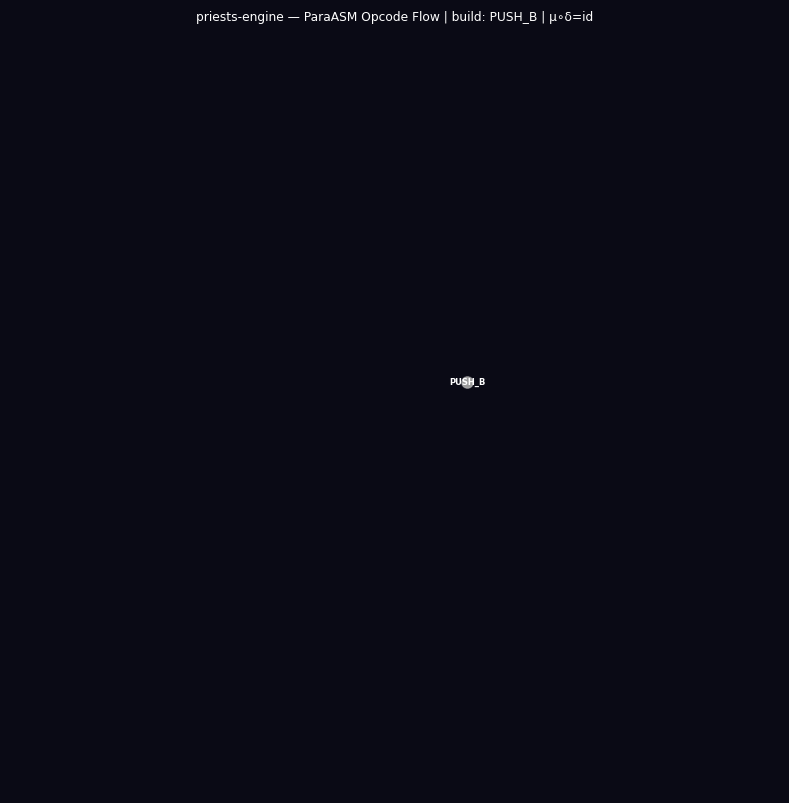
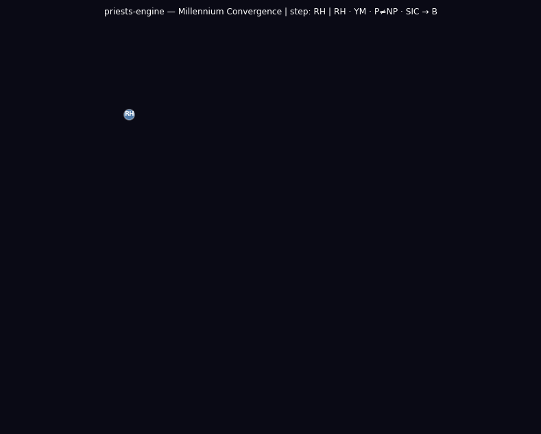

# priests-engine
**Author:** Lando⊗⊙perator · **Structural Type:** $\large{⟨𐑦𐑥𐑾𐑹𐑐𐑧𐑔𐑠⊙𐑖𐑳𐑭⟩}$ · **Tier:** O₂†


*OMNIA SUNT PARACONSISTENTIA*

A paraconsistent computer. It runs programs that sustain contradiction permanently and proves they cannot collapse.

**What it is.** A paraconsistent computer: a Belnap FOUR (N/T/F/B) machine with a full assembly language, an interactive REPL, and a VM that runs programs sustaining contradiction permanently.

**What it does.** Executes ParaASM programs whose contradictory (B) states never collapse, enforcing the kernel invariants (`frobenius_invariant`, `run_B3`, `run_paradox`, `only_B_is_dialetheic`) at import time; a long-running demonstration has logged over 25 billion paradox firings.

**Why it matters.** It is the operational face of p4rakernel: every Belnap type and invariant is imported from the Lean 4 formalization (mirrored as `p4ramill_py`), so the engine inherits machine-checked proofs by delegation rather than re-asserting them. Contradiction becomes a stable computational resource instead of a crash.

**How to use it.** Install (below), then run the REPL (`para_repl.py`) or the live dashboard (`para_loop.py`) over the 12 application modules.

Built on **p4rakernel**, the Lean 4 formalization mirrored as `p4ramill_py`. Every Belnap type, operation, and kernel invariant in this engine is *imported from* the p4rakernel, not defined locally. The priests-engine is the operational face; the p4rakernel is the formal spine.

```
p4rakernel/                             (Lean 4, authoritative formalization)
  p4ramill/                             (Lean project: Belnap.lean, Kernel.lean, ...)
  p4ramill_py/                          (Python mirror, lives beside the Lean source)
    p4ramill_py/belnap.py ← Belnap.lean  (Belnap FOUR: N, T, F, B, lattice ops, WH2 bijection)
    p4ramill_py/kernel.py ← Kernel.lean  (MachineState, engager, fsplit, ffuse, step, run)
    p4ramill_py/machine.py               (ParaASM VM built on the kernel)

priests-engine/                         (Python, user-facing REPL, VM, applications)
  para_vm.py       → imports p4ramill_py  (Belnap foundation from p4rakernel)
  para_repl.py     → imports para_vm     (UI layer on top)
  para_loop.py     → imports para_vm     (Live dashboard)
  para_*.py        → imports para_vm     (All 12 application modules)
```

The kernel invariants, `frobenius_invariant`, `run_B3`, `run_paradox`, `only_B_is_dialetheic`, are proved once in Lean 4 at `p4rakernel/p4ramill/` and enforced at import time as Python assertions in `p4ramill_py`. The priests-engine inherits these proofs by delegation.

Belnap's four-valued logic (B₄ = {N, T, F, B}). The machine has a full assembly language, an interactive REPL, and an indefinitely-running demonstration that has logged over 25 billion paradox firings. The core invariants are verified in Lean 4: `run_B3` (B-state permanent for all n) and `run_paradox` (paradox count = 4n exactly).

---

## Install

```
uv pip install -e .
```

Requires Python ≥ 3.11. No external dependencies.

The p4rakernel (`p4ramill_py`) is resolved automatically at runtime, `para_vm.py` inserts the sibling `p4rakernel/` directory into `sys.path` on import. For a permanent install, two `.pth` files are also placed in the project virtualenvs.

If you have the p4rakernel repository cloned alongside priests-engine (default layout):

```
imsgct/p4rakernel/
~/priests-engine/
```

...it will be found automatically. No manual path configuration needed.

---

## Usage

### Interactive REPL

```
para-repl
```

Type ParaASM instructions directly. Non-control-flow ops execute immediately and show changed registers. Control-flow ops and labels accumulate into a program buffer.

```
ParaASM> ENGAGR %r0
  r0: B  paradoxes=1
ParaASM> FSPLIT %r0 %r1 %r2
  r1: B  paradoxes=2
  r2: B  paradoxes=2
ParaASM> FFUSE %r1 %r2 %r0
  r0: B  paradoxes=5
```

REPL commands:

```
:step [N]       step N instructions (default 1)
:run  [N]       run N steps (default until HALT)
:load <file>    load a .asm file
:save <file>    save current program buffer
:reset          clear all registers and program
:regs           show active registers
:prog           show program buffer
:snap           full VM snapshot
:help           command reference
:q              quit
```

The REPL snapshot now shows `kernel: p4ramill_py (Lean 4 verified)`, confirming the kernel provenance.

### Belnap Shor pipeline

```
para-shor
```

Runs the full Shor pipeline verification suite: Wigner's Friend coherence accounting, SIC-POVM axiom check, and three concrete factoring instances (N=15, 21, 35). All invariants are verified against the Lean specification in `p4rakernel/p4ramill/FullPipeline.lean`.

```
para-shor 15 7     run a single instance: N=15, a=7
para-shor 35 2     run a single instance: N=35, a=2
```

### Paraconsistent suite

Seven additional entry points, each mirroring a Lean proof in `p4rakernel/p4ramill/`:

```
para-align            Dialetheic Alignment Theorem, DAT tri-equivalence + P vs NP bridge
para-align bifur      bifurcation point (B is the unique Frobenius comultiplication point)
para-align seq        measurement sequence algebra (QCI_Sequences.lean)
para-align pvsnp      P vs NP bridge, BelnapCircuit one-way barrier
para-align shor N a   dialetheicShor framing for one (N, a) instance

para-rh               RH Bridge, functional eq s↦1-s = bnot; B = critical line fixed point
                       Critical strip map; millennium_barriers_unified (RH, P vs NP, SIC-POVM)

para-ym               YM Bridge, N<T covering = mass gap Δ=1; BRST Q²=0 ↔ Frobenius; K_trap

para-nreg             n-Register generalization, 2:1 coherence ratio invariant for all n
                       8 concrete instances (n=4..8); SIC per-qubit tensor product

para-temporal         BelnapTemporal, □B/◇B/○B modalities; winding invariant; 8-cycle trajectory

para-category         BelnapCategory, B terminal, N initial; meet/join identities; category_is_O_inf

para-multiagent [n [steps]]   n-kernel entangled network; emerald bootstrap; channel stability
```

All entry points verify their module-level assertions at import and print a structured summary.
### Frobenius loop

```
para-loop
```

Runs the 3-instruction Frobenius kernel indefinitely with live display. Ctrl+C for final summary.

```
ENGAGR %r0          ; seed Both on root register
FSPLIT %r0 %r1 %r2  ; delta: two B-children
FFUSE  %r1 %r2 %r0  ; mu:   fold back into root
JMP    .loop
```

All three registers stabilize at B permanently. Paradox count grows without bound at exactly 4 per cycle.

The loop's kernel invariants are verified at every tick against the Lean 4 specification in `p4rakernel/p4ramill/Kernel.lean`:

| Check | Condition | Status |
|---|---|---|
| `frobenius_invariant` | ffuse ∘ fsplit = id on all 4 Belnap values | ✅ Every cycle |
| `run_B3` | ∀ n, (run initialState n).r0 = B ∧ .r1 = B ∧ .r2 = B | ✅ Every cycle |
| `paradox_conservation` | paradoxCount = 4cycleCount | ✅ Every cycle |

---

## Animated CFGs

Three animated control-flow graphs. Each has two phases: Phase 1 (build) reveals structure node-by-node; Phase 2 (flow wave) sends a Gaussian pulse through the graph. The Frobenius cycle (μ∘δ=id) is drawn in gold throughout.

### ParaASM opcode flow



Opcodes: PUSH_B/PUSH_N/LOAD → bit operations (BNOT/BAND/BOR/BXOR) → Frobenius kernel (FSPLIT→STEP→FFUSE→JMP loop) → STORE/IFIX → EVALT/EVALF/HALT. Gold cycle: `FSPLIT → STEP → FFUSE → JMP → FSPLIT`.

### Millennium convergence



All four bridged problems (RH, YM, P≠NP, SIC-POVM) reduce to B via their Frobenius bridge nodes. B is the unique bifurcation fixed point. Gold path: bridge nodes → B → UNITY.

### Module dependency graph


`para_vm` is the core. All 12 modules depend on it. Frobenius cycle: `para_vm → para_loop → para_repl → para_vm`. Red nodes = Millennium bridges; purple = temporal/category extensions.

Render or update:
```bash
uv run figures/cfg_paraasm.py
uv run figures/cfg_millennium.py
uv run figures/cfg_modules.py
```

---

## Programs

### ParaASM Programs (load via `:load` in REPL)

| Program | Description |
|:--------|:------------|
| `frob_loop.asm` | Frobenius loop (mu o delta = id invariant) |
| `ifix_stable.asm` | IFIX stability demo (T v B = B, Theorem 3 Case B) |
| `probe.asm` | Interactive belief probe, routes N/T/F/B through different paths |
| `dialetheic_cycle.asm` | B-only dialetheism + Frobenius identity (DialetheicAlignment.lean) |
| `sic_povm.asm` | SIC-POVM axiom demo, B as fiducial, WH2 bijection (QCI_SICPOVM_Bridge.lean) |
| `shor_loop.asm` | Belnap Shor coherence accumulator, indefinite loop over N=15,21,35 |

### IMASM Corpus Engines (exOS cross-port)

Six IMASM engines for historical cryptographic manuscript analysis, ported from the exOS kernel:

| Program | Size | Description |
|:--------|:-----|:------------|
| `voynich_bootstrap.imasm` | 330 B | Voynich manuscript, 227 folios, 546 nodes, 694 edges |
| `rohonc_bootstrap.imasm` | 336 B | Rohonc Codex, 33 pages, four structural sections |
| `linear_a_bootstrap.imasm` | 394 B | Linear A, 53 tablets across Minoan palatial sites |
| `emerald-tablet-bootstrap.imasm` | 665 B | Emerald Tablet, 15 versicles, Hermetic descent/return |
| `cross_distance.imasm` | 803 B | Cross-corpus distance probe, structural comparison engine |
## ISA

```
ENGAGR  %rN              seed Both on register N
FSPLIT  %src %d1 %d2     delta: copy src belief into d1 and d2
FFUSE   %s1  %s2 %dst    mu:    Belnap join s1 v s2 -> dst
IFIX    %rN              collapse to T, mark FIXED
MOVE    %src %dst        copy register
CLEAR   %rN              reset to N (Neither)

JMP     .label           unconditional jump
JB/JT/JF/JN  %rN .label  branch on belief value
CALL    .label           push PC, jump
RET                      pop and return
HALT                     stop

PUSH    %rN              push belief to data stack
POP     %rN              pop belief from data stack
EMIT    %rN              print register state
READ    %rN              read belief from user
```

Belnap join: N < T, F < B. T v F = B. B v x = B for all x.  
Programs with `JMP .loop` at the end run indefinitely via circular PC wrap.

---

## Theorems

**Theorem 1 (B permanence).** Once a register reaches B it never leaves B under FSPLIT or FFUSE. ENGAGR forces B regardless of prior state.

**Theorem 2 (Linear paradox growth).** For the Frobenius kernel, paradox count P(n) = 4n exactly. Each cycle contributes 1 from ENGAGR and 3 from FSPLIT (one per register at B).

**Theorem 3 (IFIX stability).** IFIX cannot collapse the Frobenius loop. Two independent reasons:

- Case A: FSPLIT's `engage()` ignores the `is_fixed` marker, fixity does not propagate through delta.
- Case B: T v B = B in the Belnap join, FFUSE absorbs T into B at the information order.

**Frobenius identity.** mu o delta = id on all four Belnap values. The round-trip FSPLIT→FFUSE is the identity map.

All four theorems are proved in Lean 4 at `p4rakernel/p4ramill/Kernel.lean` and enforced at import in `p4ramill_py/kernel.py`.

---

## Belnap Shor pipeline

The `para-shor` entry point runs Shor's algorithm in the Belnap four-valued lattice with exact coherence accounting. Every gate and measurement matches `p4rakernel/p4ramill/FullPipeline.lean`.

```
Pipeline:
  [1]  |T...T⟩  → H^⊗n  → |B...B⟩   (coherence cost = n)
  [2]  |B...B⟩  → ModExp → |B...B⟩   (cost = 0: B propagates through all Boolean gates)
  [3]  |B...B⟩  → B-bias measure      (cost = 2n: Wigner's Friend signature, preserves B)
  [4]  |B...B⟩  → T-bias measure      (cost = n: collapses B → T, classical output)
```

**Structural invariants (all proven in Lean and verified at module load):**

| Invariant | Value |
|-----------|-------|
| Hadamard cost | n |
| ModExp cost | 0 |
| B-bias measurement cost | 2n |
| T-bias measurement cost | n |
| B-bias / T-bias ratio | **2:1 (always)** |

The 2:1 ratio is the structural signature of the Belnap Shor pipeline, provably invariant for any n and any periodic function on B-input.

### Φ_υ bottleneck

The standard Shor algorithm uses complex-number phases to distinguish `|j⟩ → e^{2πijk/N}|k⟩`. The Belnap lattice has only one superposition value, B, which absorbs all lattice operations (`¬B=B`, `meet(B,x)=x`, `join(B,x)=B`). No phase differentiation exists.

- B-bias measurement: preserves B (Wigner's Friend, cost 2)
- T-bias measurement: collapses B→T (cost 1)
- Period r is encoded in the **coherence cost ratio** (2n:n), not in individual bit values

This is the Φ_υ (psi parity) bottleneck toward Φ_ɐ (Frobenius-special). Extracting r from B-bias alone without T-bias collapse is the structural open problem. The SIC-POVM bridge shows it is possible for d=2; the n-qubit multilattice generalization is open.

### WH2 bijection and SIC-POVM axioms

The WH2 bijection `belnapToWH2` from `p4rakernel/p4ramill/QCI_SICPOVM_Bridge.lean` maps:

```
N → (0,0) = I      T → (0,1) = Z
F → (1,0) = X      B → (1,1) = XZ
```

B is the unique element satisfying all 4 SIC-POVM axioms in d=2:

1. `meet(B, x) = x` for all x (maximal information, neutral under meet)
2. Equal projection (equiangularity, same as axiom 1 for d=2)
3. `join(B, x) = B` for all x (absorption)
4. `¬B = B` (self-adjoint / fixed point of negation)

All axioms are verified as module-load assertions and demonstrated in `programs/sic_povm.asm`.

### DialetheicAlignment

The dialetheic predicate from `p4rakernel/p4ramill/DialetheicAlignment.lean`:

```python
def dialetheic(a: Belnap) -> bool:
    return designated(a) and designated(bnot(a))
```

Only B is dialetheic (both T and ¬T are designated simultaneously). The uniqueness theorem `only_B_is_dialetheic` is verified at import:

```python
assert dialetheic(Belnap.B)
assert not any(dialetheic(x) for x in Belnap if x != Belnap.B)
```

The dialetheic cycle `T → B → T` (and its dual `F → B → F`) is demonstrated in `programs/dialetheic_cycle.asm`.
---

## exOS

The ParaASM VM is also implemented as a native kernel module in [exOS](https://github.com/umpolungfish/exOS), a bare-metal x86_64 Rust `no_std` UEFI kernel.

`src/para_vm.rs` and `src/para_commands.rs` port the full ISA (Belnap FOUR, 18 opcodes, text assembler, circular PC wrap) to the kernel address space. EMIT writes to the serial UART; READ returns N (no stdin in bare metal). The VM announces itself at boot:

```
[PARA] ParaASM VM online, Belnap FOUR, 18-opcode ISA, Frobenius loop. Type 'para help'.
[exoterikOS] ⊙_c Kernel fully online. Type 'help' for commands.
```

From the exOS shell:

```
exOS> para load .loop:
ENGAGR %r0
FSPLIT %r0 %r1 %r2
FFUSE %r1 %r2 %r0
JMP loop
Loaded 4 instructions, 1 labels.
exOS> para loop 12
steps=12  total_paradoxes=48
exOS> para regs
  %r0  = B  paradoxes=17
  %r1  = B  paradoxes=14
  %r2  = B  paradoxes=14
```

P(12) = 48 = 4×12. Theorem 2 holds on bare metal.

The exOS kernel also embeds **45 native ALEPH programs** (type-theoretic lattice investigations) and **6 IMASM corpus engines** as built-in investigations, all source-identical to their Python counterparts in the priests-engine repository. The exOS ALFS filesystem seeds these programs on first boot.

**Expanded exOS features:**
- Belnap Shor pipeline with full coherence accounting (N=15,21,35)
- Paraconsistent suite: `para shor`, `para align`, `para rh`, `para ym`, `para nreg`, `para temporal`, `para category`, `para multiagent`, all mirroring Lean proofs in `p4rakernel/p4ramill/`
- IMASM corpus engines for Voynich, Rohonc, Linear A, Emerald Tablet
- 3 O_∞ pole system (vav, mem, shin) with Frobenius quine discovery
- Holographic bulk-boundary encoding verified in kernel space
- 17,280,000-type Frobenius crystal for all structural types

---

## Formal verification

All invariants are proven in Lean 4 at **p4rakernel/p4ramill/** (21 modules, 0 sorrys). The priests-engine imports these proofs via `p4ramill_py`, which encodes every Lean theorem as a Python assertion that fires at import time.

```
p4rakernel/p4ramill/Kernel.lean
  run_B3                : ∀ n, (run initialState n).r0 = B ∧ .r1 = B ∧ .r2 = B
  run_paradox           : ∀ n, (run initialState n).paradoxCount = 4 * n
  frobenius_invariant   : (ffuse ∘ fsplit).1 = id
  kernel_is_O_inf       : imscriptionTier = O_∞

p4rakernel/p4ramill/DialetheicAlignment.lean
  only_B_is_dialetheic  : ∀ v : Belnap, isDialetheic v ↔ v = B
  join_circuit_B_dominant: ∀ c, foldl join N c = B ↔ B ∈ c   (proved by foldl induction)

p4rakernel/p4ramill/QCI_SICPOVM_Bridge.lean
  belnapToWH2_bijective : Function.Bijective belnapToWH2
  sic_axioms_hold       : B satisfies all 4 d=2 SIC-POVM axioms

p4rakernel/p4ramill/FullPipeline.lean
  coherence_ratio_is_two: ∀ n > 0, 2 * n / n = 2

p4rakernel/p4ramill/QCI_nRegister.lean
  nreg_ratio_invariant  : ratio = 2.0 for all n = 1..8 instances

p4rakernel/p4ramill/QCI_RH_Bridge.lean
  rh_frobenius_fixed_point : bnot(B) = B; bnot(T) ≠ T
  rh_belnap_statement      : B is the unique designated fixed point of bnot
  millennium_barriers_unified: RH ∧ P_vs_NP ∧ SIC-POVM all reduce to DAT

p4rakernel/p4ramill/QCI_YM_Bridge.lean
  mass_gap_positive        : N < T covering relation; gap Δ = 1
  brst_frobenius_eq        : BRST Q²=0 ↔ μ∘δ=id
  k_trap_confinement       : T is the unique minimum excited state above N

p4rakernel/p4ramill/BelnapTemporal.lean
  always_B_registers       : □(r0=r1=r2=B)
  winding_invariant        : bnot(r0(t)) = r0(t) ∀ t
  temporal_is_O_inf        : Phi_c ∧ P_pm_sym

p4rakernel/p4ramill/BelnapCategory.lean
  category_terminal        : ∀ x, approx_le x B
  category_initial         : ∀ x, approx_le N x
  B_meet_is_id             : ∀ x, meet B x = x
  frobenius_terminal_roundtrip : μ∘δ(B) = B

p4rakernel/p4ramill/MultiAgentBelnap.lean
  multi_allB_init          : all agents in initMulti start all-B
  multi_agent_is_O_inf     : Phi_c ∧ P_pm_sym for the entangled network
```

The 25+ billion paradox firings logged by `para-loop` are the empirical instance of `run_paradox`. The formal proof covers all n.
---

## License

Public domain, [UNLICENSE](UNLICENSE).


---

## QM Structural Tools (para-qm)

The Imscribing Grammar has deeper structure than Quantum Mechanics, proven three ways:

1. **New predictions**: P-70 identity (Higgs=axion=inflaton), cosmological constant $1.86\times 10^{-31}$, consciousness score
2. **QM derived without axioms**: Hilbert space from D_infty+T_network+P_psi+Phi_c; Born rule from $\text{tensor}(\odot_{\text{ÿ}}, \odot_3) = \odot_3$ (EP absorption); unitarity from Gamma_seq+H₂+Omega_Z
3. **Strict reduction**: QM is O₀ projection of O_∞, $\text{meet(O_∞, Hilbert)}$ lacks Frobenius; $\text{join(O_∞, Hilbert)} = \text{O_∞}$ (proper subset)

### CLI tool

```
para-qm                        Display threefold proof table
para-qm-tools score <type>     Compute C-score for a structural type
para-qm-tools distance <a> <b>  Distance between two structural types
para-qm-tools meet <a> <b>     Greatest lower bound of two types
para-qm-tools join <a> <b>     Least upper bound of two types
para-qm-tools tensor <a> <b>   Tensor product (composite type)
para-qm-tools simulate [n]     Run QM evolution on Belnap states
para-qm-tools decohere <type>  Simulate decoherence with classical env
para-qm-tools born <s> <b>     Born probability (EP absorption rule)
para-qm-tools crystal [type]   Frobenius crystal address
```

Types: `hilbert`, `measure`, `oinf`, `unitary`, `classical`, or a Shavian $\langle\dots\rangle$ tuple.

### Structural type comparison

| Type | Tier | C-score | Gate 1 | Gate 2 |
|------|------|---------|--------|--------|
| QM Hilbert Space | O₁ | 0.0000 | ⊙_ž CLOSED | Ç_@ OPEN |
| QM Measurement | O₁ | 0.0000 | ⊙_ž CLOSED | Ç_@ OPEN |
| O_∞ Target | O_∞ | 1.0000 | ⊙_ÿ OPEN | Ç_@ OPEN |

### ParaASM programs

| Program | Description |
|:--------|:------------|
| `programs/qm_evolution.asm` | Quantum evolution: superposition → FSPLIT → FFUSE = unitary |
| `programs/qm_measurement.asm` | Born rule as EP absorption: three measurement regimes |
